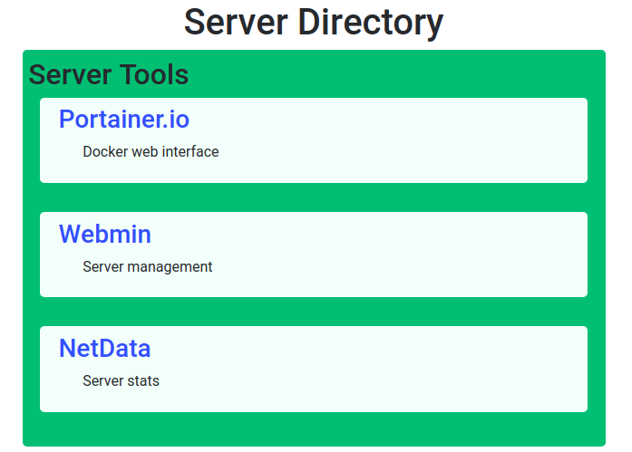

# Simple Service Directory

A simple web directory to list all the services and tools available on your server on a single website, so you can easily list and access all these services from one place. Powered by Bootstrap.



## Requirements

* Python 3.x
* flask (available via PIP)
* optional: create a Python virtualenv

## How to set elements

All the elements are set in the file sections.json. This file is read each time a request is made on the web server, so there's no need to reload the Python script when any modification is performed on the file.

We organize our services in two levels:

* Section: a group of services (i.e. Torrent clients)
  * Element: a service (i.e. Transmission, Qbittorrent, Rutorrent)

sections.template.json has a few examples to check how the sections and elements are set on the file.

## Settings

Misc settings can be set on settings.json, such as:

* Route on the Flask webserver for the index ("/" by default)
* Host of the webserver ("127.0.0.1" by default, set to "0.0.0.0" to expose)
* Port of the webserver (8080 by default)
* Flask debug (0/False by default, set to 1 to enable)
* Page title

## How to run

```sh
python3 SimpleServiceDirectory
```
